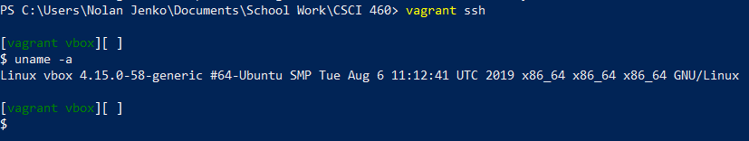

# CSCI-460 PA0
The main goal of this assignment and in turn this Readme is to familiarize myself with some of the tools that will be used in CSCi 460. Such as using markdown to write this and the basics of commands in vagrant.
****
## Task #1
* Done!
****
## Task #2
 * The three sites that I have chosen are [Computer Vision Recipes](https://github.com/microsoft/computervision-recipes), [Github Readme Stats](https://github.com/anuraghazra/github-readme-stats), and [Piskel](https://github.com/piskelapp/piskel). 
 * These three repos have several things in common, the first one that is the most obvious is a well written general overview of their repository. The second similarity is a section on how to implement/setup the application or code in the repo. Lastly there is a section on how to contribute to the project as well as licensing.
 ****
## Task #3
Base on the image below it seems as though the command 'uname -a' is simply displaying the OS and architecture that vagrant is based on.
 

*****
## Task #4
### Initial inspection of the commands
#### Part 1.
##### Initial inspection of the commands
  - Well based on past experience I know that the 'cd ~' command brings you to the home directory.
  - 
#### Part 2.
Well based on the emphasis on manual, I am going to say that this is a reference to man pages or running 'man [command]' to learn more about a specific command in the terminal.
#### Part 3
I would say scapy is my favorite tool I don't know if it counts as it is not a native tool, but is fun to use as it allows you to manipulate/monitor packets. Such as capturing them, or tracing their path.
